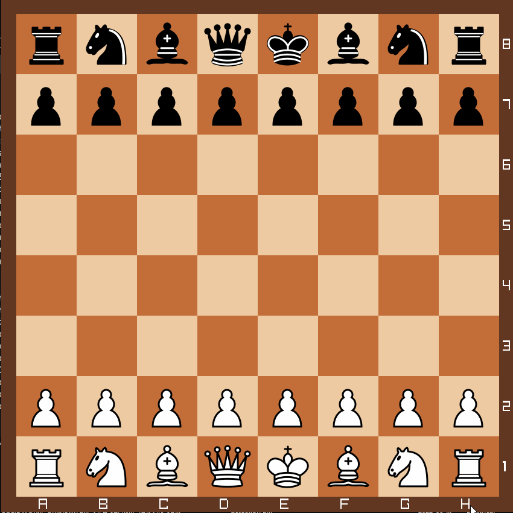

# chess 

- [Features](#features)
- [About the project](#about-the-project)
- [Installation](#installation)
- [Dependencies](#dependencies)
## features
* drag and drop mechanism for moving pieces
* castling queen and king side
* utility function to read FEN notation
* files and ranks displayed
* Written in plain C++ code (C++20) using camelCase notation
* Hardware accelerated and used with Raylib library
## about the project
  
The purpose of this project is to make chess comfortable for people to play on their computer.  
In order to move pieces the latest version currently only uses click and drag system to move the pieces.  
## installation
There are two ways to install this project :
1. install project and compile on your own
2. install binaries
## dependencies
the dependencies of this project are :
* [Visual Studio 2022](https://visualstudio.microsoft.com/vs/)
* [Raylib graphics library](https://www.raylib.com/)

