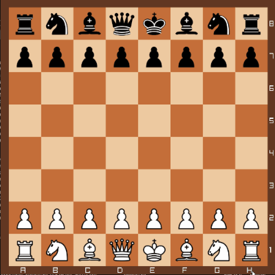

# chess 
  

- [Features](#features)
- [About the project](#about-the-project)
- [Installation](#installation)
- [Dependencies](#dependencies)
- [Upcoming features](#upcoming-features)
- [Files](#files)
## features
* **drag** **and** **drop** mechanism for moving pieces
* **castling** queen and king side
* utility function to read **FEN** **notation**
* files and ranks displayed
* Written in plain **C++** code (C++20) using camelCase notation
* Hardware accelerated and used with **Raylib** library
* **Free** and **open** **source**
## about the project
  
The purpose of this project is to make chess comfortable for people to play on their computer.  
In order to move pieces the latest version currently only uses click and drag system to move the pieces.  
## installation
There are two ways to install this project :
1. install project and compile on your own
2. install binaries
## dependencies
the dependencies of this project are :
* [Visual Studio 2022](https://visualstudio.microsoft.com/vs/)
* [Raylib graphics library](https://www.raylib.com/)
## upcoming features
* en-passant movement
* analysis mode
* play against computer (stockfish mostly)
* theme customization
* play online against your friends
## files
* assets - folder containing the assets
* chess - folder containing all the source code
* setup - folder containing setup vs project
* README.md - readme file
* chess.sln - Visual Studio solution file
* setup.msi - setup file to download the program
